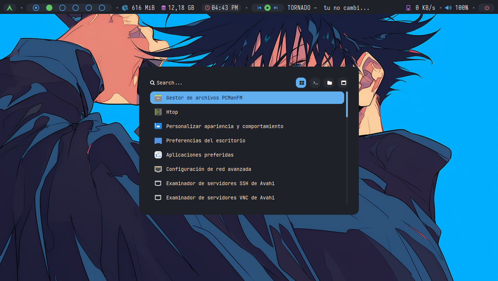
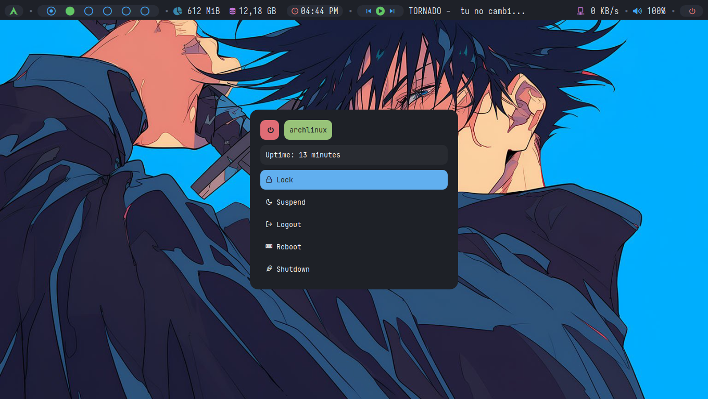

# Personalización de BSPWM
## Requisitos
Verificar que tengas instalados los siguientes paquetes:
+ Tener actualizado el sistema(`sudo pacman -Syu`) o base de datos de los paquetes(`sudo pacman -Syy`).

